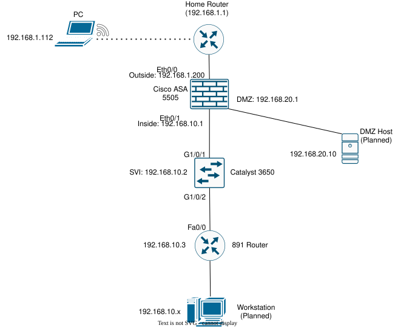

# Network Home Lab

Three pieces of used Cisco gear on a shelf, wired into a real network behind my
home router. I built this to get past the point where I'd only configured things
in Packet Tracer — physical hardware breaks in ways simulators don't, and working
through that is most of what I've learned here.

Everything is configured from the CLI. No ASDM, no web GUI.

---

## Topology



## Hardware

**Cisco ASA 5505** running 8.2(5)26 on a Base license. Handles the security
zones and NAT for the lab. It arrived booting into a 2007 image that had to be
cleared out from rommon before it would come up on the right one.

**Catalyst 3650-24PD** running IOS-XE 16.12.5b. Layer 2 access and the management
SVI for the inside network.

**Cisco 891-K9** running 15.1(4)M4. Came password-locked with no way in — I
recovered it through rommon. It's cabled but not yet in the routing path.

Console access is a Keyspan USA-19HS on COM3 that I move between the ASA and the
router, plus a mini-USB straight into the switch on COM5.

---

## What it does right now

The inside network has working internet access. The ASA is doing PAT for
192.168.10.0/24 out to its outside interface at 192.168.1.2, with stateful
inspection handling return traffic.

```
Home Router 192.168.1.1
      |
   ASA 5505      outside 192.168.1.2  ·  inside 192.168.10.1  ·  dmz 192.168.20.1
      |
Catalyst 3650    SVI 192.168.10.2
      |
  891 Router     192.168.10.3
```

The DMZ zone is configured — its own subnet, security level 50, and the
`no forward` command the Base license requires — but nothing is plugged into it
yet, so the interface sits down/down. I've left it that way rather than pretend
otherwise.

Next up is OSPF between the ASA and the 891, then ACLs, syslog, and a
site-to-site VPN.

---

## A few design choices

**The switch doesn't route.** `ip routing` is off on purpose, so all traffic
between segments has to go through the firewall.

**No trunks.** Only VLAN 10 crosses either uplink, so there's nothing to tag.
The 5505's Base license doesn't support trunking anyway.

**The Base license limits the design.** It only allows two fully routed
interfaces, so the DMZ needs `no forward interface Vlan1` — it can't go straight
out, it has to route through inside first.

---

## Addressing

| Segment | Subnet | Gateway |
|---|---|---|
| Home / outside | 192.168.1.0/24 | 192.168.1.1 (not managed) |
| Inside | 192.168.10.0/24 | 192.168.10.1 (ASA) |
| DMZ | 192.168.20.0/24 | 192.168.20.1 (ASA) |

Full breakdown in [docs/ip-addressing.md](docs/ip-addressing.md).

---

## Layout

```
/configs      Device configurations
/docs         Addressing, inventory, topology
```

Passwords are stripped out of anything committed here.

---

CCNA certified, working toward CCNP Enterprise.
